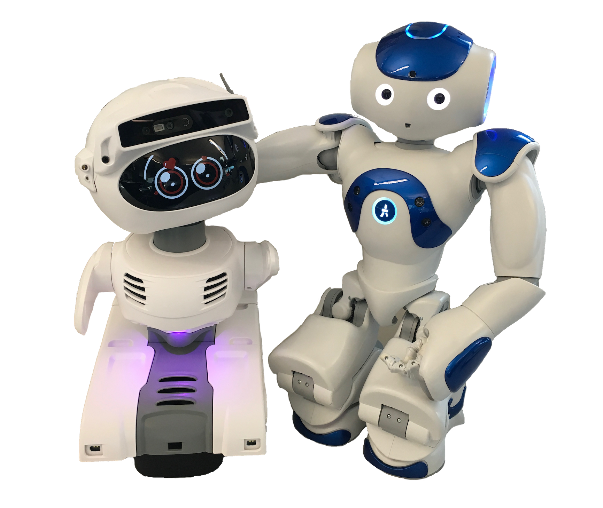

# Robo Dojo: Intro to Python

In the workshop, absolute beginners will learn some basic concepts of how to write Python application for the Palo Alto Library's robots [Dewey and Elsie](<https://library.cityofpaloalto.org/program-robotics>).



The tutorial is made possible by a [Python Software Foundation](<https://www.python.org/psf-landing/>) grant. Related slides are available [here](https://docs.google.com/presentation/d/1rChLpRqLzicN0_daZIKergGYlbedKjcOZc2hhkFs2Z0/edit?usp=sharing). The tutorial and slides are developed by [Dan Lou](<https://github.com/fishbb>).

## Use Python to make Dewey say something

With three lines of code, we make Dewey say whatever sentence we'd like it to say. Choregraphe code is available as [PythonSay.crg](./source/PythonSay.crg)

### Related Python concepts

#### What is a variable?

Variables are containers for storing data values.

Unlike other programming languages, Python has no command for declaring a variable.

#### How to define a variable?

A variable is created the moment you first assign a value to it.

#### What is an object?

Python is an object oriented programming language.

Almost everything in Python is an object, with its properties and methods.

A Class is like an object constructor, or a "blueprint" for creating objects.

#### What is a method? 

In Python, a method is a function that is available for a given object because of the object's type. A method is associated with an object.

## Use Python to make Dewey say things repetitively

With six lines of code, we make Dewey repeat a sentence for a certain amount of times. Choregraphe code is available as [PythonSayLoop.crg](./source/PythonSayLoop.crg)

### Related Python concepts

#### Python loops

- For loop
- While loop

#### Python conditional statement

- Python if statement

## Use Python to make Elsie display a grimace

With a few lines of code, we make Elsie display a grimace while making some sound. Python script is available as [ElsieGrimace.py](./source/ElsieGrimace.py)

### Related Python & API concepts

#### What is an API?

An API, or Application Programming Interface, is a server that you can use to retrieve and send data to using code. Do you know that most of modern websites are powered by APIs?

#### Making API Requests in Python

In order to work with APIs in Python, we need tools that will make those requests. In Python, the most common library for making requests and working with APIs is the requests library. 

If you use pip to manage your Python packages, you can install requests using the following command:

`pip install requests`

Once you’ve installed the library, you’ll need to import it. Let’s start with that important step:

`import requests`

You can simply use the Python Interpreter available on https://www.python.org/ to test out the following example. 

To make a ‘GET’ request, we’ll use the requests.get() function, which requires one argument — the URL we want to make the request to. For example: 

```
import requests
response = requests.get('https://www.python.org/psf/')
print(response) # this will print out the response status code
print(response.text) # this will print out the text of the response
```

#### API status code

Status codes are returned with every request that is made to a web server. Status codes indicate information about what happened with a request. Here are some codes that are relevant to GET requests:

* 200: Everything went okay, and the result has been returned (if any).
* 301: The server is redirecting you to a different endpoint. This can happen when a company switches domain names, or an endpoint name is changed.
* 400: The server thinks you made a bad request. This can happen when you don’t send along the right data, among other things.
* 401: The server thinks you’re not authenticated. Many APIs require login ccredentials, so this happens when you don’t send the right credentials to access an API.
* 403: The resource you’re trying to access is forbidden: you don’t have the right permissions to see it.
* 404: The resource you tried to access wasn’t found on the server.
* 503: The server is not ready to handle the request.

## Use Python to make Dewey and Elsie interact

We make Dewey and Elsie interact with each other by writing a simple object. Choregraphe code is available as [ElsieDewey.crg](./source/ElsieDewey.crg).

### Related Python concept

By default, when you create a Python box in Choregraphe, the script looks as follows:

```
class MyClass(GeneratedClass):
    def __init__(self):
        GeneratedClass.__init__(self)

    def onLoad(self):
        #~ puts code for box initialization here
        pass

    def onUnload(self):
        #~ puts code for box cleanup here
        pass

    def onInput_onStart(self):
        #~ self.onStopped() #~ activate output of the box
        pass

    def onInput_onStop(self):
        self.onUnload() #~ it is recommended to call onUnload of this box in a onStop method, as the code written in onUnload is used to stop the box as well
        pass
```

You can see above that a box script defines a class named `MyClass`. This class inherits from `GeneratedClass`. And `MyClass` has already some methods defined by default.

In [ElsieDewey.crg](./source/ElsieDewey.crg), we import the requests library when the Python object is activated, and remove it when the object is finished. 

The majority of the code takes place in the onInput_onStart() method when the object is activated. onStart is a default input variable defined by the object.